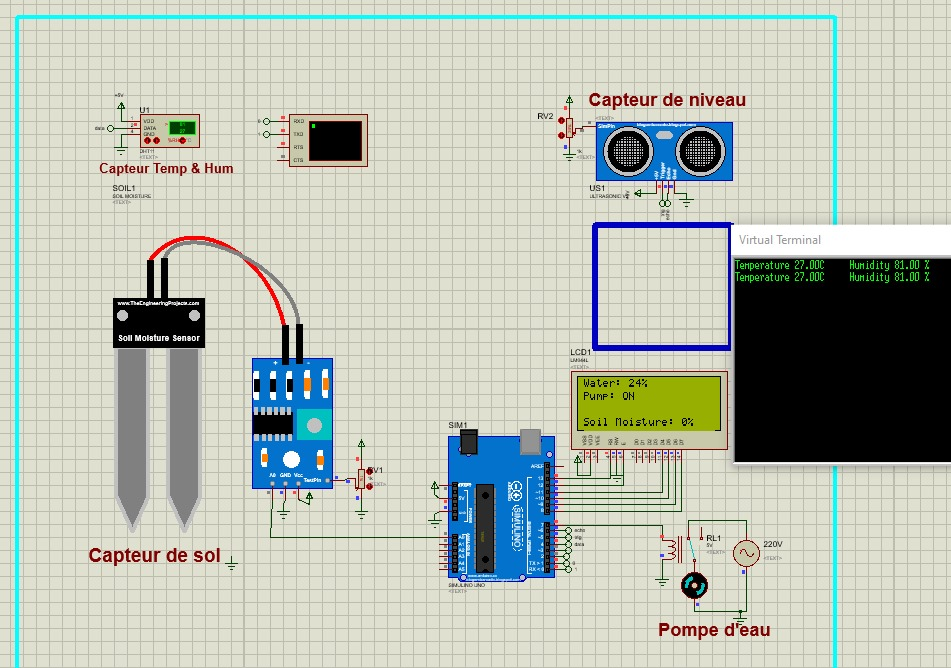
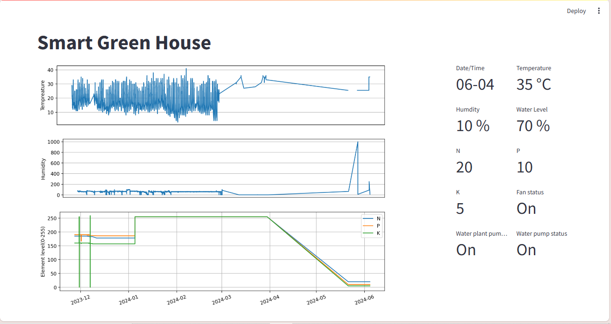

# SmartGreenHouse
Revolutionizing greenhouse agriculture through IoT technology.
# Description
By integrating wireless sensors and smart devices, this project aims to automate data collection and optimize environmental conditions for tomato cultivation. This approach promises to boost productivity while conserving resources like water and energy, meeting the demands of a rapidly growing global population.

<i>This image presents the automated irrigation system circuit diagram.</i>

# User Interface
The user interface of our IoT Smart Greenhouse project, as shown in the image bellow, is designed to
provide users with a clear and precise overview of their smart greenhouse environment. By continuously
monitoring internal conditions and nutrient levels, users can make informed decisions to optimize plant
growth. The statuses of various devices, managed by the intelligent model, also ensure that all control
systems are functioning correctly, guaranteeing a stable and optimal environment.

